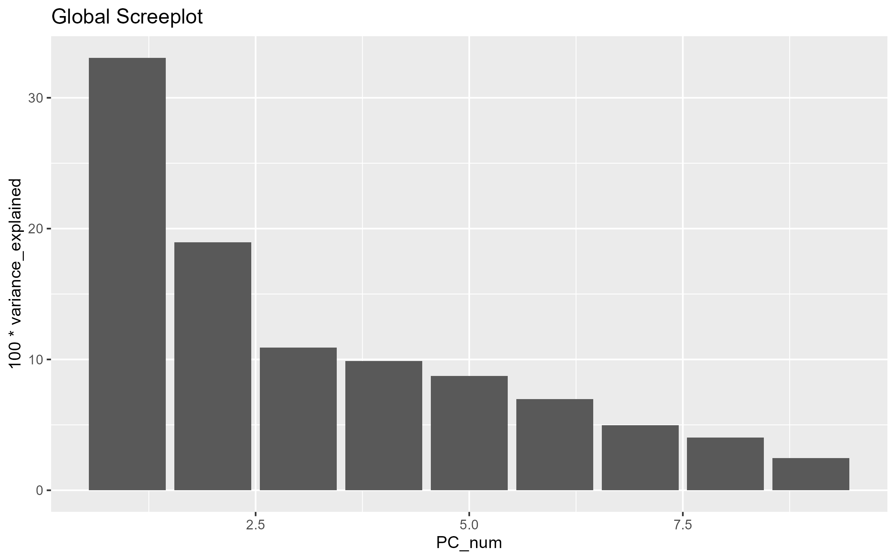
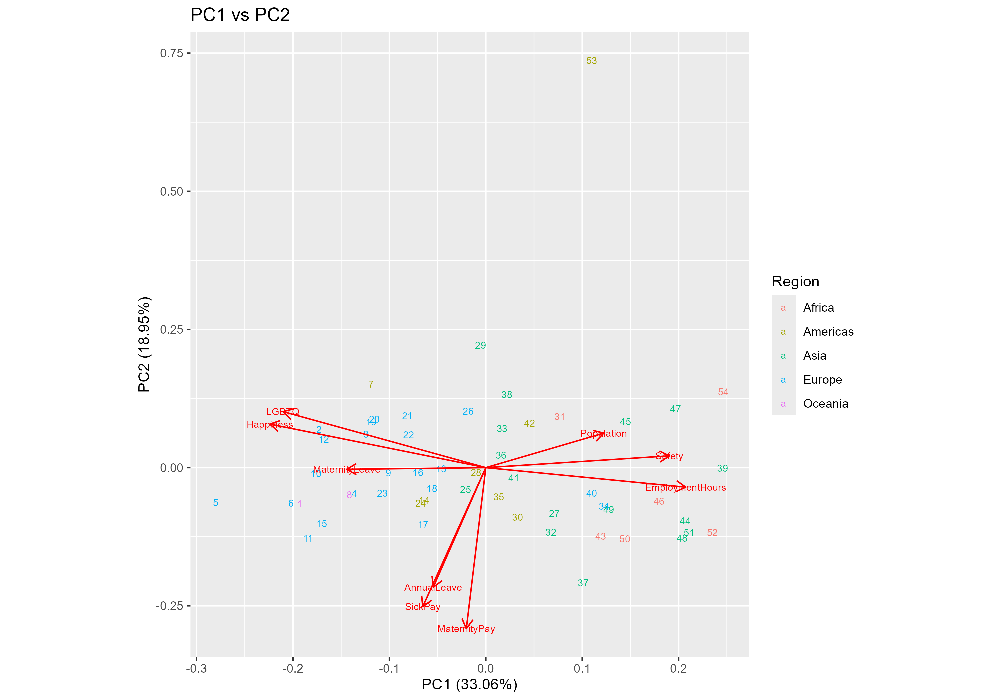
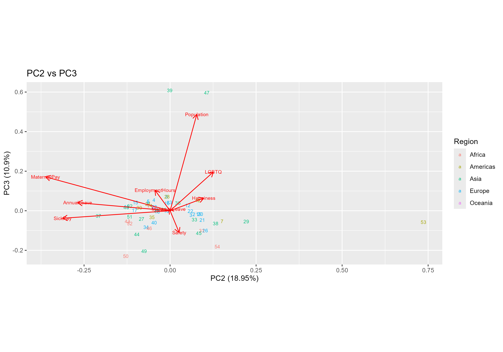
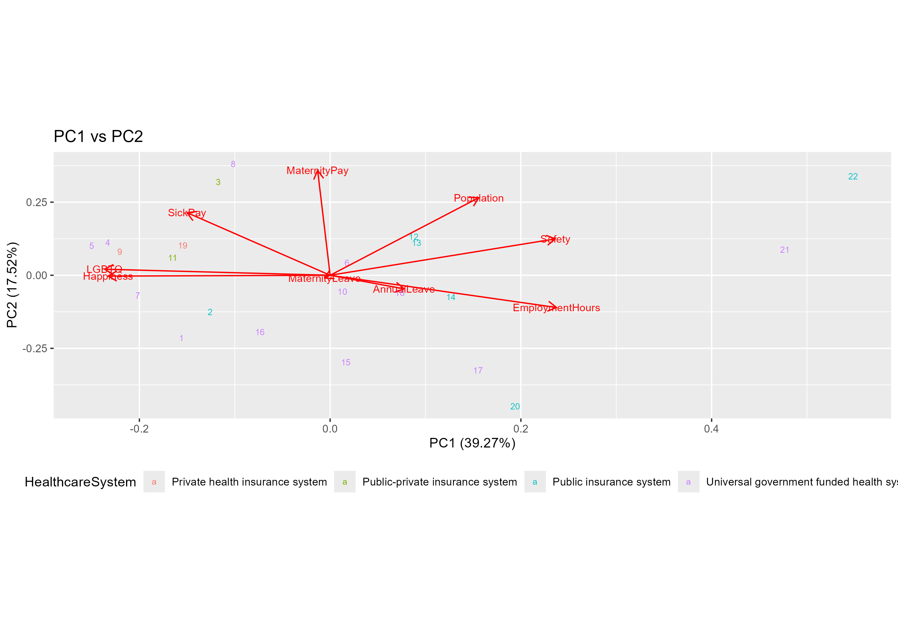

# PCA & Multivariate Analysis of Global Life–Work Balance (R)

This repository presents a multivariate statistical analysis of the **Global Life–Work Balance Index 2025** using **Principal Component Analysis (PCA)** implemented in R.
  
---
  
## 🎯 Project Objectives  

This project applies **Principal Component Analysis (PCA)** to the Global Life–Work Balance Index 2025 to explore the multivariate structure underlying international differences in life–work balance outcomes.
  
The specific objectives are to:  

1. **Reduce dimensionality** of the life–work balance indicators while retaining the dominant sources of variation across countries.  
  
2. **Identify and interpret the main latent dimensions** (PC1–PC4) driving differences in life–work balance using scree plots, biplots, and loadings.  
  
3. **Assess regional patterns** by investigating how countries from different world regions are distributed in PCA space.  
  
4. **Compare global and regional structures** by repeating the PCA for European countries only.  
  
5. **Evaluate the role of healthcare systems** in shaping life–work balance outcomes within Europe.  
  
6. Provide **interpretable visual and numerical outputs** that support evidence-based conclusions rather than purely descriptive plots.  

This analysis follows reproducible research practices, with all figures and tables generated directly from the R scripts included in this repository.
  
---
  
## 📁 Repository Structure

pca-life-work-balance-r  
│  
├── README.md  
│  
├── data/  
│   └── raw/  
│       └── global_life_work_balance.csv  
│  
├── scripts/  
│   ├── part_a_global_pca_region.R  
│   └── part_b_europe_pca_healthcare.R  
│  
├── outputs/  
│   ├── figures/    
│   │   ├── global/  
│   │   └── europe/  
│   └── tables/    
│   │   ├── global/  
│   │   └── europe/  
│  
├── .gitignore  
│   
└── pca-life-work-balance-r.Rproj  
  
---
  
## 🧾 Scripts  
- `part_a_global_pca_region.R`  
  Global PCA using all quantitative variables with regional interpretation.

- `part_b_europe_pca_healthcare.R`  
  PCA restricted to European countries, analysing the effect of healthcare systems.
  
---
  
## ⚙️ Methods
- Data cleaning using `tidyverse`
- PCA using `prcomp()` with scaling
- Visualisation using `ggplot2`, `ggfortify`, and `GGally`
  
---
  
## 🗂️ Data Source
Global Life–Work Balance Index 2025  
Source: https://remote.com/resources/research/global-life-work-balance-index
  
---  
  
## 📊 Key Results  
  
### At a glance
- PC1 captures overall **social well-being and inclusion** (~33% variance).
- **Employment protection policies** dominate PC2 globally.
- Europe-only PCA reveals stronger institutional **(healthcare) effects**.
- Removing global disparities shifts explanatory power from **geography to policy design**.
  
### 🌍 Global PCA (All Countries)

- **PC1 (≈ 33% variance)** represents a general life–work balance and social well-being axis, driven by happiness, LGBTQ inclusivity, public safety, working hours, and overall index score. Countries with stronger social protections and inclusive policies score higher on this dimension.

- **PC2** captures variation in employment benefits, particularly statutory maternity pay, sick pay, and annual leave. This component highlights policy-driven differences that are not fully explained by overall well-being.

- **PC3 and PC4** explain more nuanced structures, including population-related effects and differences in leave arrangements, indicating that life–work balance outcomes are shaped by interacting institutional and demographic factors rather than a single variable.

Regional patterns are clearly visible in the **PC1–PC2 and PC2–PC3 biplots**, where countries from the same region tend to cluster. Europe and Oceania generally occupy higher PC1 values, while Africa and parts of Asia cluster toward lower values, reflecting structural differences in labour protection and social outcomes.

The regional contribution analysis confirms that different regions dominate different components, demonstrating that the interpretation of principal components is **context-dependent**.

  
### 🇪🇺 Europe-Only PCA & Healthcare Systems  
  
Restricting the analysis to European countries alters the PCA structure:  
- Variance becomes more evenly distributed across components, indicating greater **within-region heterogeneity**.
- **Healthcare System type** shows clearer separation in PCA space, particularly along the first two components.
- Countries with **universal, government-funded healthcare systems** tend to cluster in regions associated with higher social wellbeing and employment protection.
- Compared to the global PCA, population size becomes less influential, while institutional design choices—especially healthcare and employment benefits—play a stronger role.

This comparison demonstrates that once broad global disparities are removed,**policy structure rather than geography** explains a larger share of life–work balance variation.

---
  
## 🖼️ Selected Outputs

### Global PCA






### Europe PCA (Healthcare System)

  
---

## 🧠 Overall Interpretation

The PCA results show that life–work balance is a **multidimensional phenomenon**, driven primarily by:

* Social inclusion and wellbeing

* Employment protection and leave policies

* Institutional context (region and healthcare system)

Combining PCA with regional and healthcare stratification provides a robust, interpretable framework for comparing countries on complex social and labour-market outcomes.
  
---
  
## 🛠️ Reproducibility
- All figures and tables are generated directly from R scripts.
- Output files are saved to structured directories (outputs/figures, outputs/tables).
- Code and interpretation are explicitly linked, ensuring transparency and reproducibility.

---
  
## ▶️ How to Run the Analysis

1. Clone the repository:
```bash
git clone https://github.com/eslamhussienabuelella/pca-life-work-balance-r.git
```
2. Open the project in RStudio by double-clicking:
```bash
pca-life-work-balance-r.Rproj
```
3. Run the Global PCA analysis:
```bash
source("scripts/part_a_global_pca_region.R")
```
4. Run the Europe-only PCA analysis:
```bash
source("scripts/part_b_europe_pca_healthcare.R")
```
All figures and tables will be saved automatically to:  
- outputs/figures/
- outputs/tables/
  
---
  
## 👤 Author
**Eslam Abuelella**  
MSc Data Science – Coventry University  

- GitHub: https://github.com/eslamhussienabuelella  
- Portfolio: https://eslamhussienabuelella.github.io

---
  
## License and Usage
GNU AFFERO GENERAL PUBLIC LICENSE Version 3, 19 November 2007
